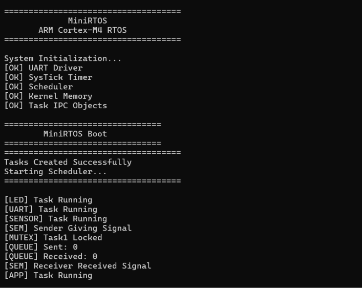
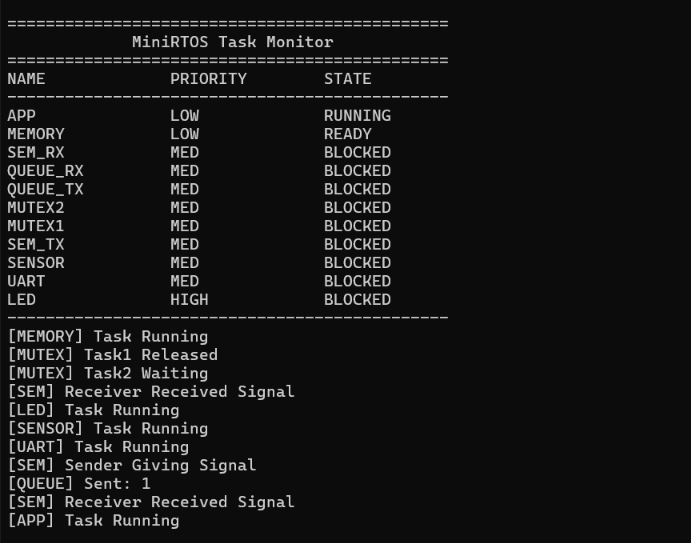

# MiniRTOS

### ARM Cortex-M4 Based Real-Time Operating System

MiniRTOS is a lightweight **Real-Time Operating System (RTOS)** developed from scratch for the **ARM Cortex-M4 architecture**.

The main objective of this project is to understand how an RTOS works internally by implementing core kernel mechanisms normally provided by RTOS platforms such as FreeRTOS.

Instead of using an existing RTOS kernel, MiniRTOS implements its own task management, scheduling, synchronization, inter-task communication, timing, and low-level ARM Cortex-M context-switching mechanisms.

The system is executed and tested using **QEMU**, with **ARM GDB** used for debugging and verification.

---

## Project Overview

MiniRTOS demonstrates the execution flow of a small embedded RTOS:

```
                 Application Tasks
                        │
                        ▼
              ┌───────────────────┐
              │     MiniRTOS      │
              │      Kernel       │
              └───────────────────┘
                        │
          ┌─────────────┼─────────────┐
          ▼             ▼             ▼
      Scheduler     Task Manager     IPC
          │             │             │
          └─────────────┼─────────────┘
                        │
                        ▼
                  SysTick / PendSV
                        │
                        ▼
                   ARM Cortex-M4
                        │
                        ▼
                       QEMU
```

## Key Features

**Task Management**
- Task creation, Task Control Block (TCB), individual task stacks
- Task function management, priorities, states, delay, and blocking
- Task names, ready/blocked task lists
- Static task and stack allocation

**Scheduling**
- Priority-based task selection with time-sliced scheduling
- Ready-list and blocked-list management
- Scheduler tick processing, time-slice countdown, expiration, and reset
- Idle task

**ARM Cortex-M4 Kernel Mechanisms**
- Cortex-M4 task stack initialization (hardware + software-saved register frames)
- Process Stack Pointer (PSP) and Main Stack Pointer (MSP)
- PendSV-based context switching using ARM assembly
- SysTick-based kernel timing

**Synchronization**
- Semaphore Give/Take with task blocking and wake-up
- Mutex Lock/Unlock with ownership tracking

**Inter-Task Communication**
- Message queues using a circular-buffer structure
- Producer-consumer communication model

**Debugging and Testing**
- UART-based debugging and RTOS task monitoring
- QEMU Cortex-M simulation
- ARM GDB debugging — breakpoint-based scheduler verification, task/priority/time-slice inspection

## Task Management

Each task is represented by a **Task Control Block (TCB)**, which stores everything the kernel needs to manage that task:

| Field | Purpose |
|---|---|
| Task Function | Entry point of the task |
| Stack Pointer | Current stack position |
| Stack Base | Base address of the task's stack |
| Stack Size | Allocated stack size |
| Priority | Scheduling priority |
| Task State | READY / RUNNING / BLOCKED / SUSPENDED |
| Delay Ticks | Remaining delay before wake-up |
| Time Slice | Remaining time slice for round-robin |
| Block Reason | Why the task is currently blocked |
| Task Name | Identifier for debugging |
| List Relationships | Linked-list pointers (ready/blocked lists) |

### Task States

```
┌──────────┐
│  READY   │
└──────────┘
     │
     ▼
┌──────────┐
│ RUNNING  │
└──────────┘
     │
     ▼
┌──────────┐
│ BLOCKED  │
└──────────┘

┌─────────────┐
│  SUSPENDED  │
└─────────────┘
```

- **READY** — the task is eligible to run and waiting for CPU time.
- **RUNNING** — the task currently owns the CPU.
- **BLOCKED** — the task cannot run until its delay or synchronization condition is satisfied.
- **SUSPENDED** — defined in the task model for task-control extension.

### Task Stack Initialization

Each task has its own stack. During task creation, MiniRTOS manually constructs the initial Cortex-M stack frame:

```
xPSR
PC
LR
R12
R3
R2
R1
R0

R11
R10
R9
R8
R7
R6
R5
R4
```

The PC is initialized with the address of the task function. This allows the context-switching mechanism to restore the task's initial CPU context and begin execution of the task.

## Scheduler

MiniRTOS contains a scheduler that manages READY and BLOCKED tasks using task priorities and time-slice management. The scheduler maintains separate task lists:

```
READY TASKS
┌────┬────┬────┬────┐
│ T1 │ T2 │ T3 │ T4 │
└────┴────┴────┴────┘

BLOCKED TASKS
┌────┬────┬────┐
│ T5 │ T6 │ T7 │
└────┴────┴────┘
```

Only tasks that are eligible to execute are considered by the scheduler.

### Scheduling Flow

```
                 SysTick
                    │
                    ▼
             Scheduler_Tick()
                    │
                    ▼
          Update Task Delays
                    │
                    ▼
          Update Time Slice
                    │
                    ▼
           Scheduling Decision
                    │
                    ▼
             PendSV Trigger
                    │
                    ▼
             Context Switch
                    │
                    ▼
             Next Task
```

The scheduler uses task priority information when selecting an eligible task. Time-slice handling allows the scheduler to track how long the current task has executed.

### Ready List

The scheduler maintains a linked list of READY tasks.

When a task becomes READY:
```
BLOCKED → (condition satisfied) → ReadyList_Add() → READY
```

When a task becomes BLOCKED:
```
READY → (delay / synchronization) → ReadyList_Remove() → BlockedList_Add()
```

This prevents blocked tasks from being selected for execution.

### Task Delay

MiniRTOS provides `vTaskDelay(ticks);`

```
Running Task → vTaskDelay() → Set delayTicks → Remove from Ready List
             → Add to Blocked List → Scheduler selects another task
```

During each SysTick, delay ticks are processed. When the delay expires:
```
delayTicks == 0 → Remove from Blocked List → Add to Ready List → Task becomes READY
```

## SysTick

MiniRTOS uses the ARM Cortex-M SysTick timer as its kernel timing source. SysTick provides periodic interrupts used for:
- Task delays and wake-up
- Time-slice management
- Scheduler timing
- Periodic kernel processing

## Context Switching

Context switching is one of the main low-level concepts demonstrated by MiniRTOS. The RTOS uses **PendSV** to perform task context switching.

```
Task A Running → SysTick Interrupt → Scheduler Tick → Scheduling Decision
              → PendSV Triggered → Save Task A Context → Select Task B
              → Restore Task B Context → Task B Running
```

The low-level context-switching mechanism uses ARM assembly together with C code.

### PSP and MSP

MiniRTOS uses the **Process Stack Pointer (PSP)** for task execution. The **Main Stack Pointer (MSP)** is used during exception and handler execution.

```
              Cortex-M4
                  │
        ┌─────────┴─────────┐
        ▼                   ▼
       MSP                 PSP
        │                   │
 Kernel / Exceptions     RTOS Tasks
```

This separation allows the kernel exception handlers and application tasks to operate with different stack contexts.

### PendSV

PendSV is used as the RTOS context-switch exception. Instead of performing the complete context switch inside the SysTick handler:

```
SysTick → Scheduler decides → PendSV triggered → Context saved/restored
```

This separates periodic timing from the actual context-switching mechanism.

## Semaphore

MiniRTOS implements semaphore-based task synchronization, providing initialization, Give/Take, task blocking, and wake-up.

```
             Semaphore
                 │
        ┌────────┴────────┐
        ▼                 ▼
   Sender Task       Receiver Task
        │                 │
        │── Give ──> Signal
                          │
                          ▼
                   Receiver wakes
```

## Mutex

MiniRTOS implements mutex-based resource protection, so only the owning task can use the protected resource at a time.

```
Mutex Take → Resource Protected → Mutex Give
```

The current implementation tracks: mutex lock state, mutex owner, and waiting task.

**Priority Inheritance:** not implemented in the current mutex implementation. The mutex does not maintain separate base and effective priorities and does not temporarily boost the owner's priority — priority inversion remains a limitation of the current implementation.

## Queue

MiniRTOS implements a message queue for inter-task communication using a circular-buffer structure (buffer, head index, tail index, element count, queue size).

```
        Producer Task
              │
              │ Queue_Send()
              ▼
       ┌──────────────┐
       │    QUEUE     │
       │  0  1  2  3  │
       └──────────────┘
              │
              │ Queue_Receive()
              ▼
        Consumer Task
```

This demonstrates the basic producer-consumer communication model.

## Idle Task

MiniRTOS includes an idle task, which runs when there are no other eligible application tasks available to execute.

```
     Are application tasks READY?
               │
          ┌────┴────┐
         YES        NO
          │          │
          ▼          ▼
      Run task   Idle Task
```

The idle task provides a safe default execution path for the scheduler.

## UART Debugging

A lightweight UART interface is used for RTOS debugging and monitoring, with functions such as `UART_Init()`, `UART_PutChar()`, and `UART_Print()`.

UART output can be used to display: system initialization, task execution, task states, semaphore operations, mutex operations, queue operations, and task monitoring information.

### RTOS Task Monitoring

MiniRTOS provides task monitoring information through UART. Example task states:

```
APP        READY
UART       BLOCKED
SENSOR     BLOCKED
SEM_RX     READY
SEM_TX     BLOCKED
MUTEX1     BLOCKED
QUEUE_RX   BLOCKED
IDLE       READY
```

This makes scheduler and synchronization behavior easier to observe during testing.


The verification status is intentionally separated from the list of implemented kernel mechanisms.

## QEMU Simulation

MiniRTOS is tested using **QEMU** to simulate an ARM Cortex-M environment, allowing the project to be executed without requiring a physical development board.

- **QEMU Machine:** `lm3s6965evb`
- **CPU:** ARM Cortex-M4

### Development Environment

| Component | Technology |
|---|---|
| Architecture | ARM Cortex-M4 |
| Instruction Set | Thumb / Thumb-2 |
| Compiler | arm-none-eabi-gcc |
| Debugger | arm-none-eabi-gdb |
| Simulator | QEMU |
| QEMU Machine | lm3s6965evb |
| Host OS | Windows |
| Shell | PowerShell |

## Project Directory

```
MiniRTOS/
│
├── src/
│   ├── main.c
│   ├── task.c
│   ├── scheduler.c
│   ├── rtos.c
│   ├── systick.c
│   ├── cortex_m.c
│   ├── pendsv.c
│   ├── pendsv.S
│   ├── semaphore.c
│   ├── mutex.c
│   ├── queue.c
│   ├── event.c
│   ├── heap.c
│   ├── timer.c
│   ├── idle.c
│   └── drivers/
│
├── inc/
│   └── Header files
│
├── startup/
│   └── startup.c
│
├── linker/
│   └── linker.ld
│
├── assets/
│   ├── boot-output.png
│   └── task-monitor.png
│
└── README.md
```

## Building the Project

From the MiniRTOS project directory:

```bash
arm-none-eabi-gcc -g -mcpu=cortex-m4 -mthumb -ffreestanding -fno-builtin -nostdlib -Iinc \
src/main.c \
src/task.c \
src/scheduler.c \
src/rtos.c \
src/systick.c \
src/cortex_m.c \
src/pendsv.c \
src/mutex.c \
src/semaphore.c \
src/queue.c \
src/uart.c \
src/list.c \
src/idle.c \
src/debug.c \
src/monitor.c \
startup/startup.c \
src/pendsv.S \
-T linker/linker.ld \
-o MiniRTOS.elf
```

Successful compilation produces `MiniRTOS.elf`.

## Running in QEMU

```bash
qemu-system-arm -M lm3s6965evb -cpu cortex-m4 -kernel MiniRTOS.elf -nographic -monitor none -serial stdio
```







## Debugging with GDB

Start QEMU in GDB debug mode:

```bash
qemu-system-arm -M lm3s6965evb -cpu cortex-m4 -kernel MiniRTOS.elf -S -gdb tcp::1234 -nographic -monitor none -serial stdio
```

Start ARM GDB:

```bash
arm-none-eabi-gdb MiniRTOS.elf
```

Connect to QEMU:

```
target remote localhost:1234
```

Useful debugging locations include: `Task_Create()`, `Scheduler_Tick()`, `Scheduler_SelectNextTask()`, `Queue_Send()`, `Queue_Receive()`.

GDB was used to inspect: current task, task priority, task state, ready list, blocked list, time slice, scheduler decisions, and IPC behavior.

## What I Learned

This project provided practical experience with:

- Embedded C and ARM Cortex-M architecture
- RTOS kernel design — task management, TCBs, scheduling, ready/blocked lists
- SysTick, PendSV, PSP/MSP, context switching, ARM assembly, exception handling
- Semaphores, mutexes, queues, and inter-task communication
- UART debugging and static memory management
- QEMU simulation and ARM GDB debugging
- Low-level C and assembly interaction

## Project Limitations

MiniRTOS is an educational RTOS project, not a production-ready operating system. Current limitations include:

- Priority inheritance is not implemented.
- Complete same-priority round-robin behavior was not conclusively verified.
- The project has primarily been tested using QEMU.
- Hardware-specific validation has not been completed.
- The scheduler and synchronization mechanisms are intentionally simplified compared with production RTOS kernels.

## Future Improvements

- Dedicated same-priority round-robin verification
- Priority inheritance
- Hardware board porting
- More complete RTOS APIs
- Improved memory management
- Additional kernel diagnostics

## Author

**Rohit Patil**
Embedded Systems | ARM Cortex-M | RTOS Development
